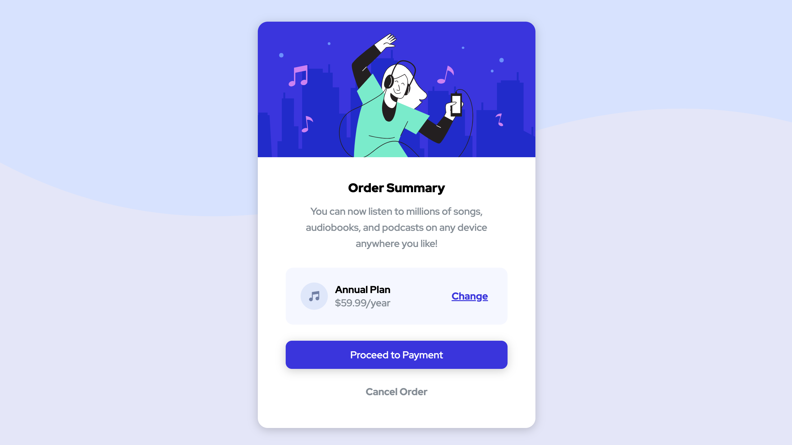

# Frontend Mentor - Order summary card solution

This is a solution to the [Order summary card challenge on Frontend Mentor](https://www.frontendmentor.io/challenges/order-summary-component-QlPmajDUj). Frontend Mentor challenges help you improve your coding skills by building realistic projects. 

## Table of contents

- [Overview](#overview)
  - [The challenge](#the-challenge)
  - [Screenshot](#screenshot)
  - [Links](#links)
- [My process](#my-process)
  - [Built with](#built-with)
  - [What I learned](#what-i-learned)
  - [Continued development](#continued-development)
  - [Useful resources](#useful-resources)
- [Author](#author)

**Note: Delete this note and update the table of contents based on what sections you keep.**

## Overview

### The challenge

Users should be able to:

- See hover states for interactive elements

### Screenshot

### Links

- Solution URL: [Add solution URL here](https://your-solution-url.com)
- Live Site URL: [Add live site URL here](https://your-live-site-url.com)

## My process

### Built with

- Semantic HTML5 markup
- CSS custom properties
- Flexbox

### What I learned

This project challenged me in several different ways. It enforced my knowledge of working with flexbox and svg files, along with absolute/relative positioning. One issue I had was using the desktop SVG file as a background image since it repeated when I used it as a background-image property in CSS, but then it pushed the content of the page down when inserted as HTML. The solution was to set the .wrapper class to relative position and hide the overflow, then to set the content container to relative position with a z-index of 1. Then I made a container exclusively for the SVG set to absolute positioning, with top/left/right values set to 0. This ensured that the background image aligned with the design specifications and didn't affect the overall layout. I re-learned that absolute positioning can only work inside of a relative position parent element.

### Continued development

I want to continue working with flexbox and solidify my understanding of certain techniques including justify-content, align-self, along with absolute vs relative positioning. 

### Useful resources

- [CSS Tricks Guide to Flexbox](https://css-tricks.com/snippets/css/a-guide-to-flexbox/) - I consult this site everytime I use flexbox, and recommend it to any #CodeNewbie.
- [Stack Overflow question about SVGs](https://stackoverflow.com/questions/69167686/how-to-prevent-svg-from-pushing-the-content-to-the-top) - Resource for working with the background image SVG that explains how the SVG container must be absolutely positioned.

## Author

- Website - [Somyo Design Co](https://elizabethrsotomayor.github.io/somyo2/)
- Frontend Mentor - [@elizabethrsotomayor](https://www.frontendmentor.io/profile/elizabethrsotomayor)
- Twitter - [@lahijadelmar_](https://twitter.com/lahijadelmar_)